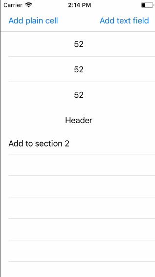

# The bug
When using Autolayout for a `UITableView` that has cells that resize based on their contents, it's possible to reload the table view so that the existing section headers and some cells stay on the table view, rather than being reused.

The headers and cells sticking around are not useful - the table view and the view controller no longer have a reference to them, which essentially makes them "leak".

# Steps to reproduce
1. Clone the project
2. Run it against an iOS 11 simulator
3. Tap "Add text field" on the top right
4. Paste in a large amount of text (~4,000 characters). Copy the text from a website like https://www.lipsum.com/
5. Keep the scroll position at the end of the expanded cell containing the characters that are pasted in (this is important)
6. Tap either "Add plain cell" or "Add text field" on the top
7. Scroll to the second section (starting with the section header that says "Header")

#### Expected
The newly added cells are displayed by themselves. This is the behaviour on iOS 10.

#### Actual
The newly added cells are obscured by a redundant and duplicated header.

